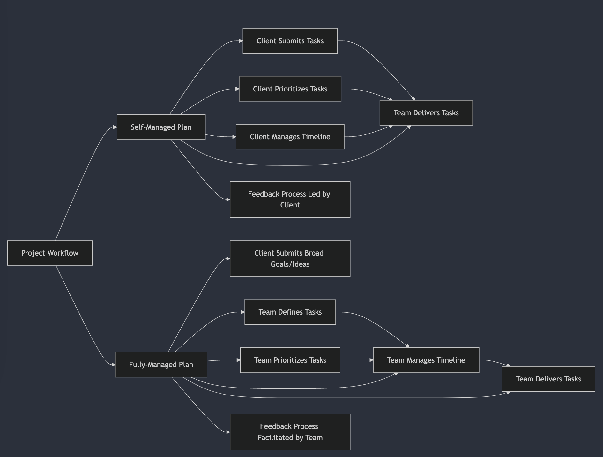

### Statement of Work

---

#### **1. Introduction**

- **Project Name**: Chinese Learning App
- **Prepared for**: Steven Landow
- **Prepared By**: Trent Brew | Turtle Labs LLC
- **Date**: Dec 30, 2024
- **Purpose**: High-level overview of the project objectives, scope, and deliverables to set clear expectations between all stakeholders.

---

#### **2. Objectives and Goals**

- Create a mobile-first Chinese learning app focused on intermediate to advanced learners that:
  - Empowers users to customize their learning experience through:
    - Importing content from various sources (YouTube, podcasts, articles)
    - Creating and sharing custom flashcards, sentences, and stories
    - Integrating with tools like Anki, DuChinese, and Language Reactor
  - Provides an intelligent review system with:
    - Multiple-choice vocabulary quizzes with app validation
    - Grammar exercises focused on sentence translation
    - Speech practice through mobile speech-to-text
    - Personalized recommendations based on performance
  - Delivers a modern, accessible experience through:
    - Intuitive one-tap navigation to key actions
    - Playful mascot animations and distinct personality
    - Full offline functionality for core features
    - Text-to-speech for accessibility
  - Focuses on sustainable growth through:
    - Free core features with optional paid features for API-dependent services
    - Community-driven content sharing
    - Efficient architecture for near-zero server costs
    - Regular content and feature updates

---

#### **3. Scope of Work**

##### **3.1. Core Deliverables**

The following is a high-level overview of the core deliverables for the project. It is not exhaustive, but rather a starting point we can build on.

Milestones are created in a Notion Kanban board and will be shared for you to track progress and create tickets. Milestones are comprised of tasks(issues), which are also created in the Notion board.

- **Design**:

  - Modern mobile UI/UX design with distinct visual identity and custom mascots
  - Streamlined navigation focused on minimal user friction
  - Accessible design/auditing for WCAG requirements
  - Design system documentation and component library
  - High-fidelity mockups for key user flows
  - Comprehensive style guide for tone, voice, and localization
  - Animation and motion design for a modern, playful experience

- **Features**:

  - Dictionary & Vocabulary Management:

    - Robust word lookup with multiple search methods
    - Detailed word pages with definitions, examples, and related compounds
    - User-editable definitions and custom mnemonics
    - Tagging and organization system

  - Review System:

    - Game-like vocabulary quizzes with app validation
    - Multiple choice and free-form translation exercises
    - Grammar practice through sentence translation
    - Progress tracking with streaks and analytics
    - Speech practice via mobile speech-to-text

  - Reader Functionality:

    - In-line dictionary lookups while reading
    - Text-to-speech for words and sentences
    - Sentence-level translations
    - Content bookmarking and favorites
    - Offline access to downloaded content

  - Content Tools:
    - Sentence authoring tool for annotating imported content
    - Support for stories, podcasts, and song lyrics
    - Audio attachment and recording capabilities
    - Manual word/sentence linking correction tools

- **Platform**:

  - Cross-platform Flutter mobile app (iOS and Android)
  - Supabase backend with real-time sync capabilities
  - Local SQLite database for offline functionality
  - Optimized state management and caching
  - Native performance through Flutter AOT compilation

- **Integrations**:

  - Language learning tool integrations (Anki, DuChinese, etc)
  - Media deep linking (Spotify, YouTube)
  - Import/export capabilities for user data

##### **3.2. Exclusions**

- Advanced AI features:
  - AI-powered translation validation
  - AI-generated content suggestions
  - AI-assisted learning recommendations
- Community marketplace features:
  - User-generated content store
  - Revenue sharing system
  - Content creator tools and analytics
- Language support beyond Mandarin Chinese and English
- Corporate/institutional features:
  - Team management
  - Progress reporting
  - Custom content creation tools
- Interactive karaoke mode and media synchronization
- Advanced analytics and insights dashboard
- Corporate subscriptions and bulk licensing

---

#### **4. Project Management**

At Turtle Labs, we typically give you two options for how we manage your project.

###### Self-Managed (Base Rate)

- Client maintains full control over task prioritization and sprint planning
- Direct access to project management tools (Linear)
- Client drives the development roadmap and timeline
- Daily standups and weekly progress reviews
- Best for teams with strong product/technical leadership

###### Fully-Managed (Base Rate + 15%)

- Turtle Labs handles complete project lifecycle management
- Strategic guidance on feature prioritization and technical decisions
- Sprint planning and resource allocation
- Proactive timeline and risk management
- Best for teams seeking turnkey development solution

##### **4.2 Core Deliverables & Timeline**

| **Phase**         | **Deliverable**                               | **Timeline**  |
| ----------------- | --------------------------------------------- | ------------- |
| **Onboarding**    | - Project kickoff & team setup                | Jan 6-12      |
| **Art Direction** | - Brand identity & design system foundations  | Jan 12-26     |
| **Design**        | - High-fidelity mockups                       | Feb 16-Mar 2  |
|                   | - Component library documentation             |               |
|                   | - Interactive prototypes                      |               |
|                   | - Landing page & marketing materials          |               |
| **Development**   | - Component library implementation            | Mar 16-Apr 13 |
|                   | - Frontend implementation                     | Apr 13-May 4  |
|                   | - Dictionary & review system                  |               |
|                   | - Reader & content tools                      |               |
| **Testing**       | - Internal QA & bug fixes                     | May 4-25      |
|                   | - User testing program                        |               |
|                   | - Performance optimization                    |               |
| **Launch**        | - App store submission & listing optimization | May 25-Jun 6  |
|                   | - Documentation & onboarding materials        |               |
|                   | - Analytics implementation                    |               |

\*Note: Timeline estimates assume standard priority queue. Expedited delivery available with Premium tier.

---

#### **5. Roles and Responsibilities**

##### **5.1 Core Team**

- **Client Responsibilities**:

  - Supply required assets and content (branding, vocab lists, etc.)
  - Provide timely feedback on deliverables (24-48hr turnaround)
  - Review and approve major milestones
    _if Self-Managed:_
    - Drive product vision and feature prioritization
    - Manage sprint planning and backlog grooming
    - Participate in daily standups and weekly reviews
    - Make key technical and product decisions
      _if Fully-Managed:_
    - Provide high-level product vision and goals
    - Available for weekly check-ins

- **Turtle Labs**:

  - Full-stack development and testing
  - UI/UX design and prototyping
  - Regular progress updates and demos
  - Technical architecture and decisions
    _If fully-managed:_
    - Sprint planning and backlog management
    - Feature prioritization and roadmap
    - Resource allocation and timeline management
    - Technical strategy and architecture decisions

##### **5.2 Supporting Team**

- **Illustrator (Natalie)**:

  - Custom mascot design and illustrations
  - Animation assets and storyboards
  - Brand identity support

- **Design Support (Lawan Alade Fa)**:

  - [Lawan Alade Fa](https://studiolafa.dev) is my long-time friend and a talented designer. We've collaborated on many projects in the past, and I plan to lean on his help for design support if needed.
  - Design support for the project
  - Design review and feedback
  - Design system documentation

- **QA Team**:

  - Comprehensive testing across platforms
  - Performance benchmarking
  - Bug tracking and verification

- **DevOps (as needed)**:
  - CI/CD pipeline setup
  - Cloud infrastructure management
  - Performance monitoring

---

#### **6. Timeline**

##### **6.1 Project Duration**

- **Start Date**: January 6th, 2025
- **Target Launch**: June 6th, 2025 (5 months)

##### **6.2 Phase Breakdown**

**Discovery & Design (4 weeks)**

- Brand identity & design system foundations
- User journeys & wireframes
- High-fidelity mockups & prototypes
- Landing page design

**Core Development (12 weeks)**

- Dictionary & search functionality
- Review system implementation
- Reader features & content tools
- Offline capabilities

**Polish & Testing (4 weeks)**

- Internal QA & bug fixes
- Performance optimization
- Beta testing program
- App store preparation

##### **6.3 Key Dependencies**

**Client-Side**

- Feedback turnaround: 24-48 hours
- Asset approvals: 3-5 business days
- Sprint planning participation (if self-managed)

**Technical**

- App store review process: 5-7 business days
- Third-party API integration approvals
  - Dictionary API access
  - Media platform deep links
  - Learning tool integrations

**Design & Assets**

- Mascot illustrations & animations
- Brand asset delivery
- Marketing materials

##### **6.4 Flexibility**

- Timeline can be adjusted based on priority shifts
- Sprints can be rebalanced for critical features
- Buffer included for unexpected challenges

---

#### **7. Budget**

Turtle Labs will provide a detailed budget and payment terms after the SOW is approved, and a management plan for the project has been established.

---

#### **8. Staying in Sync**

- Slack Connect channel in Turtle Labs workspace for quick chats & updates (provided post-approval)
- Notion workspace with project dashboard, docs & milestones (flexible setup - we'll customize together)
- Adhoc check-ins & demos as needed (no rigid schedule - let's keep it natural)
- Direct line to me (Trent) for anything you need

---

#### **9. Success Metrics**

- Define criteria for a successful project:
  - App performance (low latency, offline access).
  - Positive feedback from beta users.
  - Successful submission to App Stores.
  - Alignment with design and functionality expectations.
  - TODO: Discuss additional success metrics with Steven

---

#### **11. Next Steps**

- Review and approval of the SOW.
- Kickoff meeting to get aligned and finalize design and development priorities.
- Share relevant resources, links, tools, and account access for the project.

---
